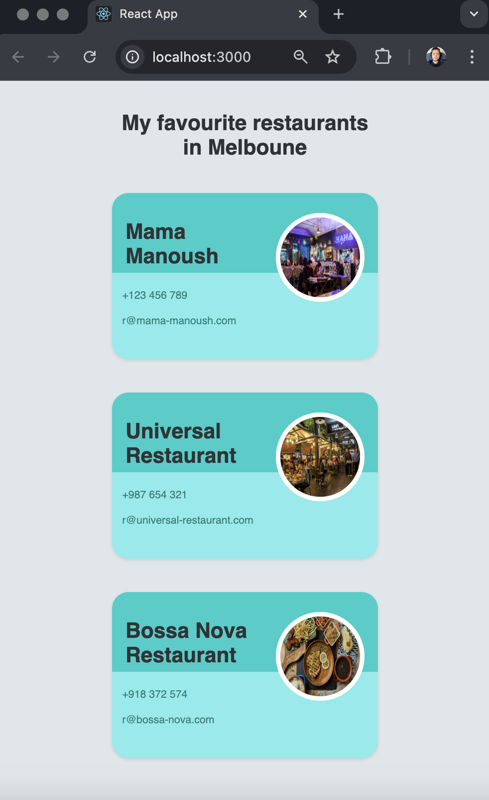

## Description
React components are the building blocks of a React application. They are reusable pieces of UI, defined as JavaScript functions or classes, that return HTML elements via JSX. Each component can manage its own state and props, making it easy to create interactive and dynamic user interfaces.

## Challenge
Follow the instruction in the index.js file

### Expected Result


## Setup

1. Clone the repository and install the dependencies
```bash
npm install
```
2. Start the frontend application locally
```bash
npm start
```